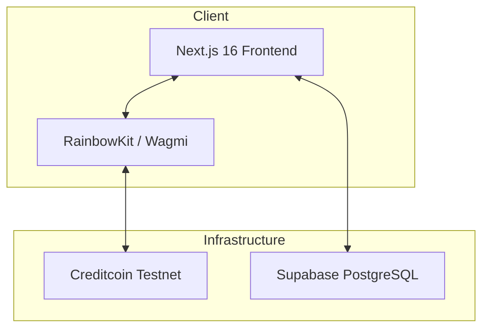
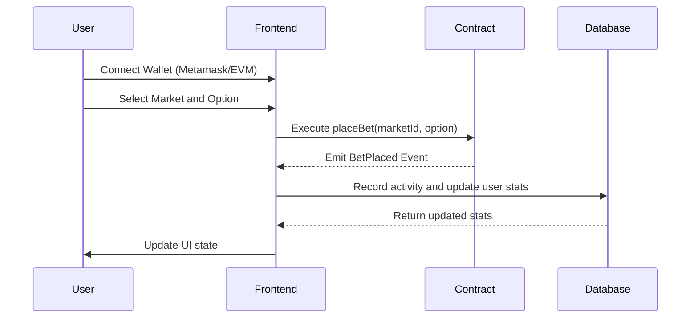

# Credit Predict

Credit Predict is a decentralized prediction market platform built on the Creditcoin Testnet. It enables users to propose and trade on the outcomes of real-world events using tCTC tokens.

## System Architecture

The application utilizes a hybrid architecture combining blockchain for financial transactions and a relational database for social features and analytics.



## Core Features

- Binary Prediction Markets: Trading on Yes/No outcomes for various event categories.
- On-chain Settlement: All bets and potential payouts are handled by audited smart contracts.
- Social Integration: Market-specific comment threads and user engagement tracking.
- Performance Analytics: Comprehensive user statistics including win streaks, ROI, and total volume.
- Real-time Activity: Live tracking of betting transactions and market updates.

## Technical Stack

- Frontend: Next.js 16 (App Router), TypeScript, Tailwind CSS
- Blockchain: Solidity, Hardhat, Creditcoin Testnet (EVM)
- Database: Supabase (PostgreSQL) with Row Level Security
- State Management: Zustand, react-query
- Wallet Integration: RainbowKit, Wagmi, Viem

## User Interaction Flow

The following diagram illustrates the lifecycle of a bet within the platform.



## Development Environment Setup

### Prerequisites

- Node.js 18.x or higher
- NPM or Yarn
- EVM compatible wallet (e.g., MetaMask)

### Installation

1. Clone the repository:
   ```bash
   git clone [repository-url]
   cd credit-markets
   ```

2. Install dependencies:
   ```bash
   npm install
   ```

3. Configure environment variables in a `.env` file:
   ```env
   NEXT_PUBLIC_CREDITCOIN_RPC_URL=https://rpc.cc3-testnet.creditcoin.network
   NEXT_PUBLIC_CREDITPREDICT_CONTRACT=0xa17952b425026191D79Fc3909B77C40854EBB4F0
   NEXT_PUBLIC_SUPABASE_URL=[your-supabase-url]
   NEXT_PUBLIC_SUPABASE_ANON_KEY=[your-supabase-anon-key]
   PRIVATE_KEY=[your-deployment-private-key]
   ```

4. Run the development server:
   ```bash
   npm run dev
   ```

## Smart Contract Integration

The platform interacts with the `PredictionMarket` contract deployed at `0xa17952b425026191D79Fc3909B77C40854EBB4F0` on the Creditcoin Testnet (Chain ID: 102031).

Key Contract Functions:
- `createMarket`: Admin function to initialize new events.
- `placeBet`: Allows users to stake tokens on specific outcomes.
- `resolveMarket`: Admin function to finalize results and enable payouts.
- `claimWinnings`: Enables users to withdraw rewards from successful predictions.

## Database Schema

Supabase is used to manage non-consensus data:
- `bet_activities`: Local cache of blockchain transactions for faster UI rendering.
- `comments`: User-generated content associated with specific markets.
- `user_stats`: Aggregated performance metrics and leaderboard data.
- `activities`: Points-based engagement records.

## Deployment

The application is configured for deployment on Vercel. Production builds use Turbopack with Webpack fallback support for specific blockchain libraries.

```bash
npm run build
```